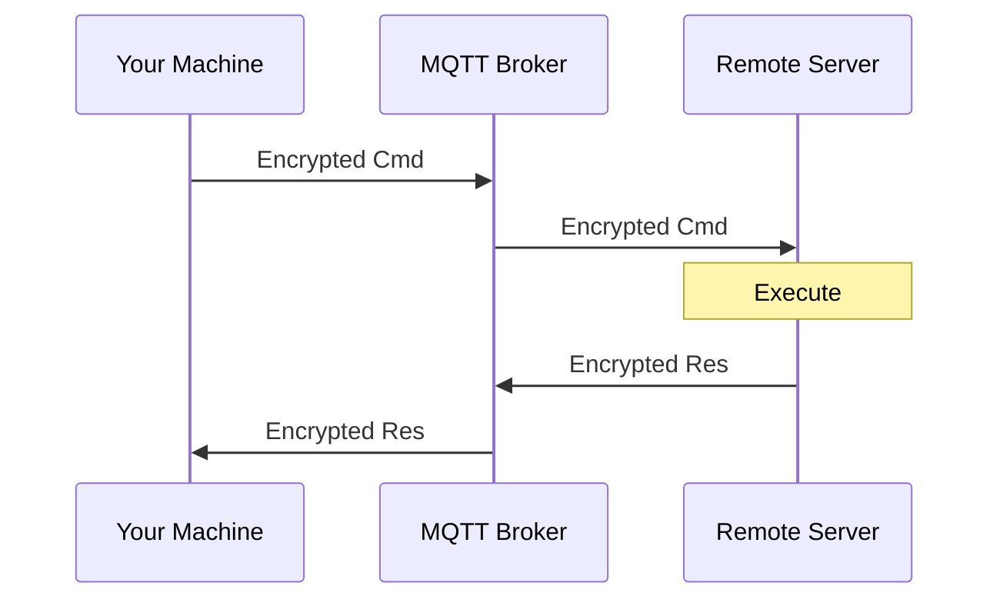

# Secure MQTT Shell

End-to-end encrypted remote shell over MQTT with AES-256-GCM encryption.

## The Problem This Solves

We've all been there: you need to manage a remote server, but opening SSH ports means exposing your machine to the entire internet. Port forwarding through firewalls is a hassle. VPNs add complexity. What if there was a way to execute commands on remote machines without punching holes in your firewall?

That's where Secure MQTT Shell comes in. By leveraging MQTT as a communication channel and implementing strong end-to-end encryption, you can manage your servers through an intermediary broker without ever exposing inbound ports. The encryption key never travels over the network—only you and your server know it. This means even the MQTT broker operator cannot decrypt your commands or responses.

Born out of necessity while managing headless servers behind restrictive firewalls, this tool lets you maintain secure, authenticated sessions without the traditional security tradeoffs of exposed services. Picture this: It's 2 AM, your production server is misbehaving, you're on a locked-down corporate network, and SSH is blocked. Your sysadmin is asleep. Your firewall rules are more complex than a tax return. You're one `iptables` mistake away from locking yourself out permanently.

Instead of playing firewall roulette or begging the network team to open "just one more port" (narrator: it was never just one more port), you deploy a single binary that phones home through MQTT. No inbound connections. No NAT traversal headaches. No explaining to security why you need port 22 open to the world. Just a clean, encrypted tunnel that works through the most paranoid firewalls known to IT departments.

The best part? The MQTT broker sitting in the middle is basically eavesdropping on gibberish. Your commands are encrypted before they even leave your keyboard. It's like passing secret notes in class, except the teacher (the broker) only sees Base64 nonsense instead of "Do you like me? Circle yes or no."

This isn't just a tool—it's your 2 AM insurance policy. Your "I told you so" when the VPN goes down. Your escape hatch when the network team is unreachable and your server is not.

## Key Features

- **Zero Inbound Ports Required** - Your server only maintains outbound MQTT connections
- **End-to-End Encryption** - AES-256-GCM ensures commands and responses are encrypted before transmission
- **mTLS Support** - Optional mutual TLS for MQTT connections adds transport-layer security
- **Obfuscated Topics** - Non-obvious MQTT topic names add an extra layer of obscurity
- **Pre-Shared Key Authentication** - Only parties with the secret key can participate
- **Real-Time Execution** - Low-latency command execution and response streaming
- **Simple Deployment** - Single binary, minimal dependencies, straightforward configuration

## Important Security Disclaimer

**USE AT YOUR OWN RISK**

This tool provides encrypted remote command execution but should be used with full understanding of the security implications:

- You are responsible for keeping your `EXEC_KEY` secure
- A compromised key means full remote access to your system
- Public MQTT brokers may log connection metadata (though not payload content)
- This tool executes arbitrary commands with the privileges of the user running the server
- Always use strong, randomly generated encryption keys
- Consider using a private MQTT broker for production deployments
- Regular security audits of your deployment are recommended

The author assumes no liability for any security incidents, data loss, or damages resulting from the use of this software.

## Quick Start

### 1. Clone and Setup

```bash
git clone https://github.com/zrougamed/mqtt-shell
cd mqtt-shell
```

### 2. Configure Environment

```bash
# Copy example config
cp .env.example .env

# Edit .env with your settings
nano .env
```

**Critical:** Change `EXEC_KEY` to a strong, unique password:

```bash
# Generate a secure key
openssl rand -base64 32
```

### 3. Build

```bash
# Build server for Linux deployment
cd server
go mod tidy
GOOS=linux GOARCH=amd64 go build -o mqtt-shell-server

# Build client for your local machine
cd ../client
go mod tidy
go build -o mqtt-shell-client
```

### 4. Deploy and Run

```bash
# On your remote server (behind firewall)
./mqtt-shell-server

# On your local machine
./mqtt-shell-client
```

## Configuration

### Environment Variables

```bash
# MQTT Broker
MQTT_BROKER_URL=tcp://broker.hivemq.com:1883
MQTT_USERNAME=
MQTT_PASSWORD=

# Topic Configuration (change this to something unique!)
MQTT_TOPIC_PREFIX=mqtt-shell-change-this-to-something-unique

# Security (CRITICAL: Use a strong random key!)
EXEC_KEY=YourVerySecretKey2025!ChangeThis

# Optional: TLS
MQTT_USE_TLS=false
MQTT_CA_FILE=/path/to/ca.crt
```

## Usage

### Interactive Shell

Once connected, you'll see an interactive prompt:

```bash
remote> docker ps
remote> netstat -tulpn | grep 9080
remote> curl -I http://localhost:9080
remote> cat /var/log/nginx/access.log | tail -20
```

### Special Commands

- `exit`, `quit` - Disconnect and exit
- `clear` - Clear the terminal screen
- `help` - Display help information

### Example Session

```
Secure MQTT Shell v1.0.0
================================

Connected to MQTT broker
Listening for responses...

remote> docker ps
Waiting for response...

Success: Command executed successfully

Command: docker ps

Output:
---
CONTAINER ID   IMAGE          STATUS        PORTS                  NAMES
1c55136c1502   nginx:latest   Up 5 minutes  0.0.0.0:9080->80/tcp   webserver
---

Time: 2025-10-19 21:30:15

remote> exit
Goodbye!
```

## Security Best Practices

1. **Generate Strong Keys** - Use 32+ random characters for `EXEC_KEY`
2. **Use Private Brokers** - Avoid public MQTT brokers for production
3. **Enable TLS** - Always use TLS in production environments
4. **Rotate Keys Regularly** - Change encryption keys periodically
5. **Limit Command Access** - Consider implementing command whitelisting
6. **Monitor Logs** - Keep track of command execution and access patterns
7. **Unique Topic Prefixes** - Use unguessable topic prefixes per deployment

## Docker Deployment

### Using Docker Compose

```bash
# Start MQTT broker + server
docker-compose up -d

# View logs
docker-compose logs -f server

# Stop services
docker-compose down
```


## Production Deployment

### Systemd Service (Recommended)

Create `/etc/systemd/system/mqtt-shell-server.service`:

```ini
[Unit]
Description=Secure MQTT Shell Server
After=network.target

[Service]
Type=simple
User=mqttshell
WorkingDirectory=/opt/mqtt-shell
EnvironmentFile=/opt/mqtt-shell/.env
ExecStart=/opt/mqtt-shell/mqtt-shell-server
Restart=always
RestartSec=10

[Install]
WantedBy=multi-user.target
```

Enable and manage:

```bash
sudo systemctl enable mqtt-shell-server
sudo systemctl start mqtt-shell-server
sudo systemctl status mqtt-shell-server
```

## Architecture

The system consists of three components:

1. **Client** - Runs on your local machine, sends encrypted commands
2. **MQTT Broker** - Acts as message relay (cannot decrypt traffic)
3. **Server** - Runs on remote machine, executes commands, returns encrypted responses



The broker never sees plaintext commands or responses—all encryption/decryption happens on the endpoints.

## Troubleshooting

### Server Not Receiving Commands

```bash
# Check server logs
journalctl -u mqtt-shell-server -f

# Verify MQTT connectivity
mosquitto_pub -h broker.hivemq.com -t "test" -m "hello"
```

### Decryption Errors

- Ensure both client and server use identical `EXEC_KEY`
- Check for whitespace or special characters in .env file
- Verify no trailing newlines in the key value

### Connection Timeout

```bash
# Test MQTT broker accessibility
mosquitto_sub -h broker.hivemq.com -t "test" -v

# Check firewall (MQTT typically uses port 1883)
sudo iptables -L -n | grep 1883
```


## Performance Characteristics

- **Latency:** 100-500ms depending on MQTT broker location and network conditions
- **Throughput:** Optimized for interactive command execution, not bulk data transfer
- **Encryption Overhead:** Minimal (~5-10ms per message)
- **Concurrent Sessions:** Single session per client/server pair (multi-session support planned)

## Contributing

Contributions are welcome and appreciated! Here's how you can help:

### Reporting Issues

Found a bug or security issue? Please [open an issue](https://github.com/zrougamed/mqtt-shell/issues) with:
- Detailed description of the problem
- Steps to reproduce
- Your environment (OS, Go version, etc.)
- Relevant log output

**Security vulnerabilities** should be reported privately via email (see contact below).

### Suggesting Features

Have an idea for improvement? [Open a feature request](https://github.com/zrougamed/mqtt-shell/issues) describing:
- The problem you're trying to solve
- Your proposed solution
- Any alternatives you've considered

### Contributing Code

1. Fork the repository
2. Create a feature branch (`git checkout -b feature/amazing-feature`)
3. Make your changes with clear, descriptive commits
4. Add tests if applicable
5. Ensure code follows Go conventions (`go fmt`, `go vet`)
6. Push to your fork
7. Open a Pull Request with a clear description

## Roadmap

Planned features and improvements:

- [ ] Multi-session support (multiple concurrent clients)
- [ ] Command history with up/down arrow navigation
- [ ] Tab completion for common commands
- [ ] File upload/download capabilities
- [ ] Interactive TTY support (nano, vim, etc.)
- [ ] Web-based dashboard for monitoring
- [ ] Comprehensive audit logging
- [ ] Multi-user authentication and authorization
- [ ] Role-based access control
- [ ] Command output streaming for long-running processes

## License

**Apache License 2.0**

Copyright 2025 Mohamed Zrouga

Licensed under the Apache License, Version 2.0 (the "License");
you may not use this file except in compliance with the License.
You may obtain a copy of the License at

    http://www.apache.org/licenses/LICENSE-2.0

Unless required by applicable law or agreed to in writing, software
distributed under the License is distributed on an "AS IS" BASIS,
WITHOUT WARRANTIES OR CONDITIONS OF ANY KIND, either express or implied.
See the License for the specific language governing permissions and
limitations under the License.

See `LICENSE` file for complete terms.

## Author

**Mohamed Zrouga**

- GitHub: [@zrougamed](https://github.com/zrougamed)
- LinkedIn: [Mohamed Zrouga](https://www.linkedin.com/in/zrouga-mohamed/)
- Mail: [Mohamed Zrouga](med@zrouga.email)

Built with passion for secure, elegant solutions to real-world infrastructure challenges.

## Acknowledgments

This project uses:
- [Eclipse Paho MQTT](https://github.com/eclipse/paho.mqtt.golang) - Robust MQTT client library
- Go standard crypto libraries - Battle-tested encryption implementations
- [godotenv](https://github.com/joho/godotenv) - Environment configuration management

Special thanks to the open source community for providing the building blocks that make projects like this possible.

---

**Remember:** With great power comes great responsibility. Use this tool wisely and secure your encryption keys properly.